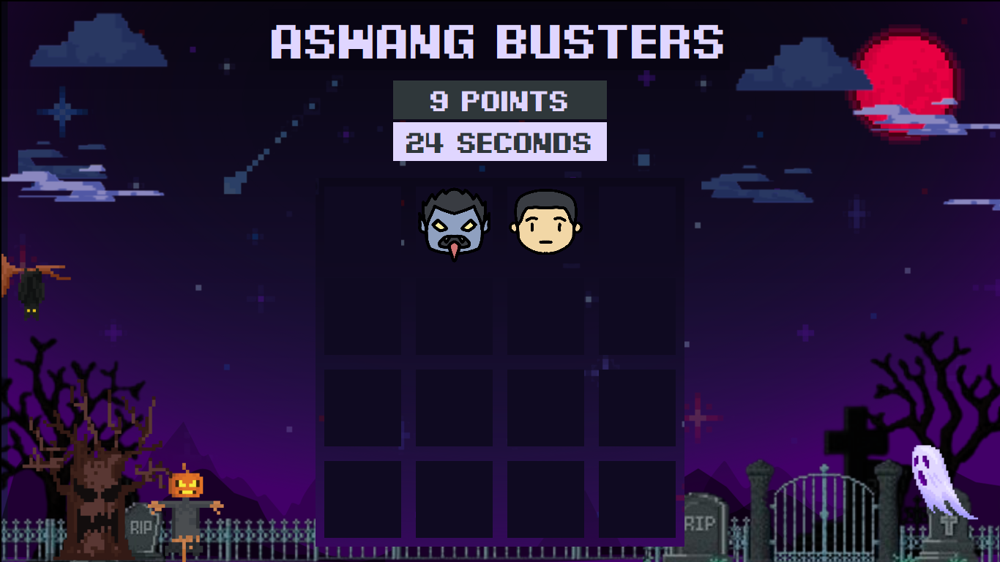

# Aswang Busters

> Python whack-a-mole like game using tkinter.

## Description

A game made in Python that uses tkinter for the GUI. Based on the Philippine folklore of evil shape-shifting creatures. The main goal of the game is to defeat the aswangs that are blending in with humans.

This game was originally developed with the concept of using the Nintendo Switch Joycon to control the cursor as a gun. You can do so using the right Joycon by connecting it to the computer through Bluetooth pairing and pressing 'j' to connect it to the cursor.

## Game Instructions

1. Shoot the aswangs to earn points.
2. Shooting a human loses a point.
3. Try to reach the highest points before the timer ends.

## Credits

Font: [Pixel Digivolve](https://www.pixelsagas.com/?download=pixel-digivolve) font by Pixel Sagas
